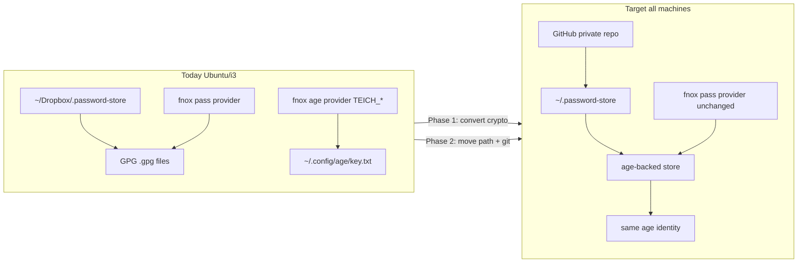

# Encryption and secrets

Resume note: age-backed secrets across public dotfiles and a private password store. Store CLI (`gopass` / `passage`) is an implementation choice, not the architecture.

**Sway plan:** [PLAN.sway.md](../aspects/aur/PLAN.sway.md) step 7 — path configured; crypto migration + clone remain **manual**. No new aspect, no mise task.

## Aim

| Concern | Choice |
|---|---|
| Crypto | `age` (X25519 / ChaCha20) |
| Master key | Private age identity never leaves the machine (or YubiKey); never pushed to git |
| Password store | Private GitHub repo → `~/.password-store`; no Dropbox |
| Dotfile secrets | SOPS / fnox in the public repo (multi-recipient) |
| Bootstrap | Manual per machine |

Two jobs stay separate:

1. **Password store** — day-to-day secrets (`fnox/` prefix, passmenu, etc.). Consumers talk to a `pass`-compatible tree; the CLI behind it is swappable.
2. **Encrypted files in public dotfiles** — PGP material and similar via SOPS/fnox. Already partly in place (`TEICH_*` on fnox age).

## Blind recipients

Keep the recipient list local and uncommitted (`PASSAGE_RECIPIENTS_FILE`, SOPS config, or equivalent). GitHub never sees who can decrypt.

- New encrypts use only the current local list.
- Revoking a leaked key: drop it locally and re-encrypt; future commits are safe.
- Old git commits still carry the old header — if the leaked key is known, historical ciphertext stays readable. Real leaks need inner-secret rotation and/or history scrub (`git-filter-repo`).

## Risk and backup

Never encrypt for a single recipient. Always multi-recipient:

1. Primary YubiKey (daily)
2. Backup YubiKey (offline)
3. Paper key (`age-keygen`, printed, in a safe)

YubiKey found by someone else: PIN + lockout after failed tries + touch policy still protect the material. Losing the only identity locks you out — that is why (2) and (3) exist.

## Store CLI — implementation detail

| Option | Strength | Weakness |
|---|---|---|
| **gopass** (age backend) | Already packaged; convert path from GPG exists; familiar | Age mode incomplete — passphrase caching flaky (constant prompts), YubiKey / mobile weak |
| **passage** ([FiloSottile/passage](https://github.com/FiloSottile/passage)) | Thin `pass` fork; native age; stable; `age-plugin-yubikey` | No QR codes |

Prefer **passage** when age reliability and YubiKey matter more than QR. Prefer **gopass** (or stay on GPG longer) when QR / existing gopass habits matter more. Either way the store shape is the same: git-backed tree under `PASSWORD_STORE_DIR`, age ciphertext, same age identity as sops/fnox/ssh bootstrap.

fnox `provider = "pass"` keeps reading the store regardless of CLI, as long as the tree decrypts. Optional later: move API keys from pass provider to fnox age like `TEICH_*` (out of scope here).

## Today → target



| Piece | Today | Target |
|---|---|---|
| Store path (Ubuntu) | `~/Dropbox/.password-store` (old `10-env.fish`) | `~/.password-store` (already in dotfiles) |
| Crypto | GPG (`.gpg`) | age (CLI TBD) |
| Decrypt key | GPG secret key (not in dotfiles) | `~/.config/age/key.txt` (+ YubiKey recipients later) |
| fnox API keys | `provider = "pass"` | unchanged while store is the source |
| fnox `TEICH_*` | already `provider = "age"` | unchanged |
| Git remote | unknown / Dropbox-sync only | GitHub private repo (manual clone) |

### Context in this repo

| Piece | Location |
|---|---|
| Store path | `PASSWORD_STORE_DIR="$HOME/.password-store"` in `aspects/dotfiles/files/.config/fish/conf.d/10-env.fish` |
| Packages (today) | `gopass` + `pass` in `aspects/aur/packages`; `pass` in `aspects/nala/packages`; `gopass` in Brewfile — revisit if switching to passage |
| GitHub git auth | `aspects/ssh/key.yml` → `mise r //aspects/ssh:keys` |
| fnox | `aspects/dotfiles/files/.config/fnox/config.toml` — prefix `fnox/` |
| Age recipient | `age1hyz…` in `fnox/config.toml` and `aspects/ssh/key.yml` |

**Two keys after migration:** SSH clones the repo; age decrypts entries. No GPG import on new machines after Phase 1.

## Phase 1 — GPG to age (keep Dropbox path)

Change only crypto. Stay at the current store location. Commands below use **gopass** where a converter exists; with **passage**, re-encrypt entry-by-entry (or script) onto an age store — same verify bar.

### 1.1 Preflight and backup

```bash
echo "$PASSWORD_STORE_DIR"    # likely ~/Dropbox/.password-store today
# list / decrypt check with current CLI
gpg --list-secret-keys        # note GPG id used by store

cp -a "$PASSWORD_STORE_DIR" "$HOME/backup/password-store-gpg-$(date +%F)"
```

Push a git backup if a remote exists; otherwise tar the backup off-machine.

### 1.2 Register age identity

Ensure `~/.config/age/key.txt` exists. How the store CLI learns it depends on implementation:

- **gopass:** `gopass age identities add` (does **not** auto-read `key.txt`)
- **passage:** recipients via `PASSAGE_RECIPIENTS_FILE` / identities as documented by passage

Confirm recipient `age1hyz…`. Passphrase on the key → pinentry ready.

### 1.3 Convert (dry run on copy first)

**gopass path:**

```bash
git clone "$PASSWORD_STORE_DIR" /tmp/password-store-age-test
cd /tmp/password-store-age-test
gopass convert --crypto=age --move=false
# verify one entry — do not log output
```

If convert crashes (known gopass issue): export with GPG, re-insert under age. Then repeat on the real store.

**passage path:** build a parallel age store from GPG exports; switch `PASSWORD_STORE_DIR` only after verify.

### 1.4 Verify consumers (still on Dropbox path)

```bash
# list + show fnox/GITHUB_TOKEN via chosen CLI
fnox exec -- env | rg '^GITHUB_TOKEN='   # do not log value
passmenu                                 # pick an entry; wl-paste/xclip ok
git -C "$PASSWORD_STORE_DIR" status
```

Phase 1 done when: store decrypts with age only; fnox and passmenu work; GPG backup retained.

## Phase 2 — Leave Dropbox for GitHub + `~/.password-store`

Only after Phase 1 is stable.

### 2.1 Ensure GitHub remote

```bash
cd "$PASSWORD_STORE_DIR"
git remote -v
# if missing: git remote add origin git@github.com:USER/STORE.git
git push -u origin main    # or master — match branch name
```

Resolve Q1 (exact repo URL) when adding the remote.

### 2.2 Move to canonical path

```bash
# option A: move (keeps git history)
mv "$PASSWORD_STORE_DIR" ~/.password-store

# option B: fresh clone
git clone git@github.com:USER/STORE.git ~/.password-store
# or: gopass clone / passage clone equivalent

source ~/.config/fish/conf.d/10-env.fish
```

Re-run Phase 1.4 at the new path.

### 2.3 Retire Dropbox copy

After GitHub push verified and new path works for a few days: archive `~/Dropbox/.password-store`; confirm nothing references `$DROPBOX_DIR/.password-store`.

### 2.4 Other machines (Arch Sway, VM)

```bash
mise r //aspects/ssh:keys
git clone git@github.com:USER/STORE.git ~/.password-store
# register age identity for chosen CLI
# list + show fnox/GITHUB_TOKEN — do not echo
```

## Done when

- Phase 1 complete on Ubuntu (age-only decrypt; fnox + passmenu work)
- Store at `~/.password-store` with GitHub remote; Dropbox copy retired
- Store list works on real Arch machine
- `fnox exec -- env | rg '^GITHUB_TOKEN='` prints a value (do not log)
- Q1 resolved; age identity registered per machine (Q2)
- Store CLI chosen (Q0) and packages/docs match

## Parked

| ID | Question |
|---|---|
| Q0 | Store CLI: passage (age/YubiKey) vs gopass (QR / status quo) |
| Q1 | GitHub URL (`git@github.com:USER/STORE.git`) |
| Q2 | Age identity on each machine (`key.txt` + CLI registration / YubiKey) |
| Q3 | VM: bind-mount host store vs manual clone vs skip |

## Risks

| Risk | Mitigation |
|---|---|
| gopass age convert / cache flakiness | Prefer passage, or test convert on `/tmp` clone; keep GPG backup |
| passage lacks QR | Accept, or keep a QR workflow outside the store CLI |
| Dropbox + git divergence | Push to GitHub before moving path |
| Ubuntu still on old `PASSWORD_STORE_DIR` | Re-link dotfiles, new shell |
| Single-recipient lockout | Multi-recipient: YubiKey ×2 + paper key |

## Open later

- Wire passage (or gopass) + `age-plugin-yubikey` and local identities
- Inject blind recipient file via env so recipients never leave the machine
- Multi-recipient SOPS/fnox for PGP private keys in the public repo
- Mark PLAN.sway step 7 done after real-machine proof
