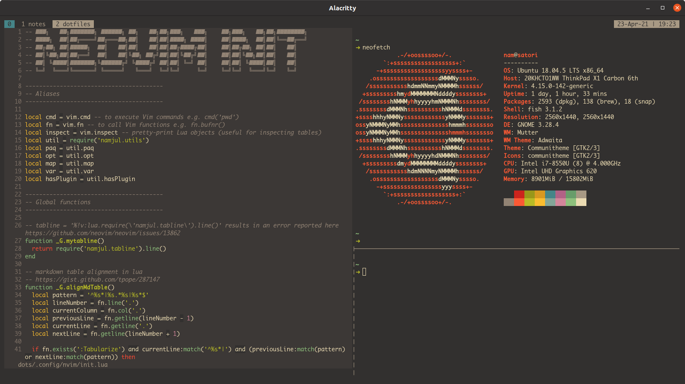

# "dotfiles"

I want to see this project as


I use [mise](https://mise.jdx.dev/) to place and oversee [aspects](https://en.wikipedia.org/wiki/Vantage_point) of this pond.
Find an overview of them [here](aspects).

Here a list of parts that might interest

- [neovim](aspects/dotfiles/files/.config/nvim)
- [tmux config](aspects/dotfiles/files/tmux.conf)
- [alacritty](aspects/dotfiles/files/.config/alacritty)
- [fish configuration](aspects/dotfiles/files/.config/fish)

It looks like this.



## Setup

### Homebrew

Homebrew needs to be setup for scripts to work.
This can be done by adding the following to `~/.profile`:

```sh
eval $(/home/linuxbrew/.linuxbrew/bin/brew shellenv)
```

### Git

```bash
export GIT_AUTHOR_NAME="name"
export GIT_AUTHOR_EMAIL="email"
export GIT_COMMITTER_NAME="$GIT_AUTHOR_NAME"
export GIT_COMMITTER_EMAIL="$GIT_AUTHOR_EMAIL"

# Set the credentials (modifies ~/.gitconfig)
git config --global user.name "$GIT_AUTHOR_NAME"
git config --global user.email "$GIT_AUTHOR_EMAIL"
```

### Installation

Clone dotfiles to home directory

```
git clone --recursive https://github.com/namjul/dotfiles ~/.dotfiles
```

cd and run `install`

## Inspiration

- https://github.com/wincent/wincent
- https://github.com/necolas/dotfiles
- https://github.com/sarrost/dotfiles
- https://github.com/simonsmith/dotfiles
- https://github.com/nicknisi/dotfiles
