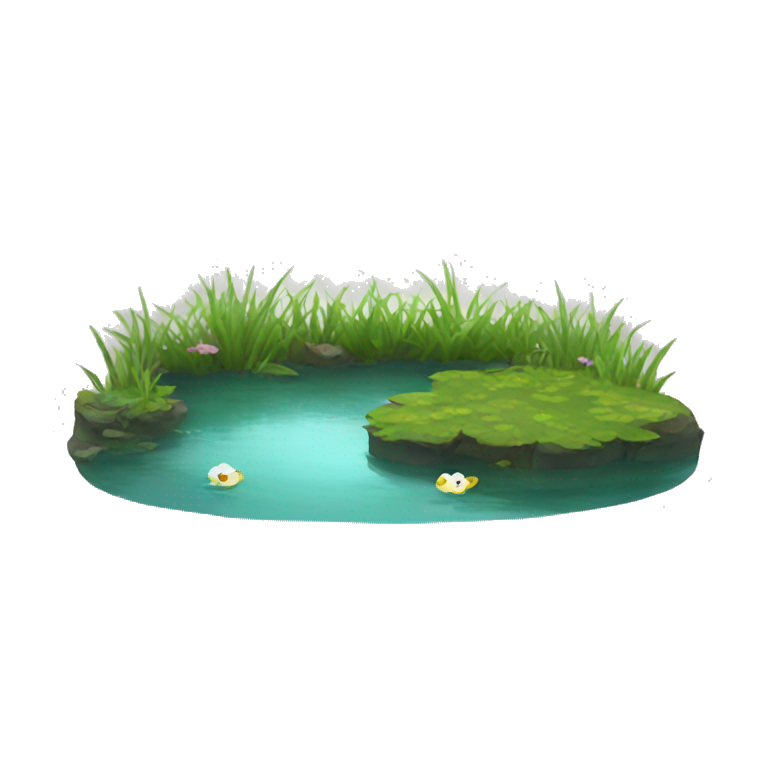

# "dotfiles"



I use [mise](https://mise.jdx.dev/) to place and oversee [aspects](aspects "Vantage points") of this pond.

dotfiles are listed [here](https://github.com/namjul/dotfiles/tree/master/aspects/dotfiles/files)

## Setup

### Homebrew

Homebrew needs to be setup for scripts to work.
This can be done by adding the following to `~/.profile`:

```sh
eval $(/home/linuxbrew/.linuxbrew/bin/brew shellenv)
```

### Git

```bash
export GIT_AUTHOR_NAME="name"
export GIT_AUTHOR_EMAIL="email"
export GIT_COMMITTER_NAME="$GIT_AUTHOR_NAME"
export GIT_COMMITTER_EMAIL="$GIT_AUTHOR_EMAIL"

# Set the credentials (modifies ~/.gitconfig)
git config --global user.name "$GIT_AUTHOR_NAME"
git config --global user.email "$GIT_AUTHOR_EMAIL"
```

### Installation

```
git clone --recursive https://github.com/namjul/dotfiles ~/.dotfiles
cd .dotfiles
./install
```

## Inspiration

- https://github.com/wincent/wincent
- https://github.com/necolas/dotfiles
- https://github.com/sarrost/dotfiles
- https://github.com/simonsmith/dotfiles
- https://github.com/nicknisi/dotfiles
- https://github.com/sapegin/dotfiles
- https://github.com/mrusme/dotfiles
