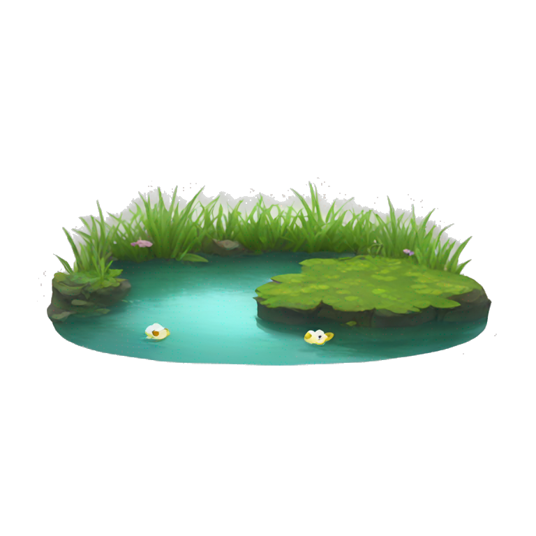

# "dotfiles"



I use [mise](https://mise.jdx.dev/) to place and oversee [aspects](aspects "Vantage points") of this pond.

dotfiles are listed [here](https://github.com/namjul/dotfiles/tree/master/aspects/dotfiles/files)
```sh
./install
```

## Inspiration

- https://github.com/wincent/wincent
- https://github.com/necolas/dotfiles
- https://github.com/sarrost/dotfiles
- https://github.com/simonsmith/dotfiles
- https://github.com/nicknisi/dotfiles
- https://github.com/sapegin/dotfiles
- https://github.com/mrusme/dotfiles
- https://github.com/echasnovski/nvim
